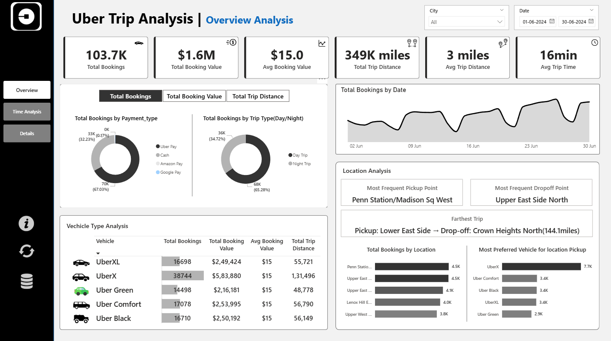

#  UBER Trip Analysis - Power BI
### !!! Project file Coming Soon- Those who Need immediate Contact me through Linked IN !!!
## Table of Contents

1. [Project Overview](#project-overview)
2. [Key Features](#key-features)
3. [Highlights](#-Highlights)
4. [Challenges Faced](#-ChallengesFaced)
5. [Insights](#-Insights)
6. [SnapShot](#Snapshots)
7. [Conclusion & Closing Remarks](#conclusion)
---

| Dashboard| 
|--------------------------|
| | 


##   📊 Project Overview:


The Uber Trip Details Analysis Power BI project is designed to provide actionable insights into ride patterns, customer preferences, and operational trends. Using interactive dashboards, the analysis focuses on trip volume, value, and distance metrics, offering a comprehensive view for data-driven decision-making.

The dataset used includes trip details (booking information, payment type, trip type, vehicle type, distance, and duration) and a location reference table with IDs and names. A calendar table was created to support time-based analysis and enable dynamic filtering.


---

## 🔍 Key Features:

* **Parameter-driven analysis** with three main KPIs: Total Booking, Total Booking Value, and Total Trip Distance.
* **Three interactive dashboard pages**:

  1. **Overview** – A summary of main KPIs, trip distribution by payment type & trip type, trends over time, vehicle type comparison, most frequent locations, and trip distance extremes.
  2. **Time Analysis** – Parameter-based visuals showing trip patterns by pickup time and day, including a unique hour-day grid to spot high-demand periods.
  3. **Details** – A dynamic table view with export functionality, responsive to applied filters.
* **General interactive features** on all pages: page navigation, refresh buttons, tooltips, and a direct GitHub repository link.

This project is a complete example of combining **Power BI’s visual storytelling** with **data modeling best practices**, aimed at enhancing operational understanding and strategic planning in the ridesharing domain.

---


## 🌟 Highlights

* **Interactive Parameter-Driven Visuals** – Dynamic charts and KPIs update instantly based on the selected parameter (**Total Booking**, **Total Booking Value**, or **Total Trip Distance**), making the analysis adaptable to different business needs.

* **Quick Insights Through Visual Filtering** – All visuals are interconnected, allowing users to filter data directly from charts and KPIs for faster, more intuitive exploration.

* **Identify Peak Demand Periods** – A unique **hour-day grid** helps easily pinpoint the highest booking times and days, aiding in demand forecasting and resource allocation.

* **Location Intelligence** – Dedicated metrics and visuals reveal:

  * **Highest booking pickup points**
  * **Highest booking drop-off points**
  * **Farthest trip distance**

* **Customer Preference Insights** – Understand the most frequently chosen Uber options such as **UberXL, UberX, Uber Green, Uber Black,** and **Uber Comfortable**, enabling better service planning.

* **Comprehensive Details Dashboard** – A fully filter-responsive **table visual** at the end dashboard provides detailed trip-level data with the option to **export** for external reporting or deeper analysis.

* **User-Friendly Navigation** – Page navigation buttons, a home button with refresh state, and informative tooltips make the dashboard intuitive and accessible for all users.

---

## ⚡ Challenges Faced

* **Dual Relationships Management** – Handling active/inactive relationships between the **Location** and **Trip Details** tables to separately analyze pickup and drop-off locations.
* **KPI Formatting** – Creating separate measures for text-based KPIs (e.g., *349K miles*) and numeric measures for calculations & parameters.
* **Custom Trip Type Logic** – Building a **Day/Night trip classification** based on manual hour-based conditions.
* **Calendar Table Creation** – Generating a calendar from `PickupDate` with additional fields (date, month, year, day name, day number).
* **Date Hierarchy for Trends** – Implementing a date hierarchy for the area chart X-axis.
* **Advanced DAX Metrics** – Using complex DAX to calculate **most frequent pickup**, **most frequent drop-off**, and **farthest trip**.
* **Time Grouping** – Grouping trips into **10-minute intervals** for granular time-based area chart analysis.
* **Dynamic Grid Customization** – Customizing a grid visual to change colors dynamically based on the selected parameter.

---
## 📊 Insights

* **Peak Demand Patterns** – Highest trip volumes are observed during specific hours and days, identified using the **hour-day grid** visualization.
* **Preferred Uber Options** – **UberX** and **UberXL** emerge as the most chosen ride options, with noticeable demand for premium services like **Uber Black** during peak hours.
* **Payment Trends** – Clear distribution between **cash** and **digital payment methods**, with digital dominating in certain high-volume areas.
* **Location Hotspots** – Recurrent high-demand pickup and drop-off points indicate strong service areas for potential marketing or driver allocation.
* **Long-Distance Rides** – Outlier trips with significant distance highlight occasional intercity travel demand.
* **Trip Type Patterns** – Night trips form a consistent share of total bookings, suggesting stable after-hours demand.
* **Granular Time Insights** – 10-minute interval analysis reveals micro-trends in trip requests that may be missed in hourly aggregation.

---

## SnapShots

---

| Overview | 
|--------------------------|
| | 


---
| Time Analysis | 
|--------------------------|
| | 

---
| Details Overview | 
|--------------------------|
| | 

---


##### Parameter Based Analysis
---
| Total Booking| Total Booking Value|Total Trip Distance|
|-------------|-------------|-------------|
|||

---

|Tooltip| 
|--------------------------|
| | 

---

#### ER Diagram


---

## Usage

1. **Clone the Repository:**
   ```bash
   git clone https://github.com/abhaysiva/UBER-Power-Bi-analysis.git
   ```
---

## ✅ Conclusion & Closing Remarks

The **Uber Trip Details Analysis** project showcases the power of **Power BI** in transforming raw trip data into **actionable business insights**. By leveraging parameter-driven visuals, advanced DAX calculations, and interactive filtering, the dashboards provide a clear and engaging view of operational trends, customer preferences, and demand patterns.

This analysis not only supports **strategic decision-making** but also highlights how tailored visual storytelling can make complex datasets easy to understand for stakeholders at all levels.

🔹 Whether for **operations optimization**, **marketing strategy**, or **driver resource allocation**, this project serves as a flexible and reusable template for ridesharing analytics.

---

💡 *Explore the repository, interact with the dashboards, and feel free to adapt the model for your own datasets.*

---

### Connect With Me

**[[ABHAY SIVA M]](www.linkedin.com/in/abhaysiva)**